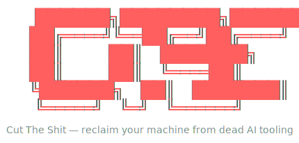

<div align="center">



### Cut The Shit — reclaim your machine from dead AI tooling

A fast, safe CLI that finds and removes **dead skills, agents, plugins and MCP servers** left behind by AI coding tools — with dry-run, confirmation and automatic backups.

[](https://github.com/Lordymine/cts/actions/workflows/ci.yml)


[](LICENSE)


</div>

---

## The problem

Every AI coding tool you try leaves a trail: orphaned skills, abandoned agent CLIs, plugin caches, marketplace clones, MCP servers configured once and forgotten. It piles up — **hundreds of megabytes of disk**, and worse, **dozens of tool and skill definitions injected into every prompt's context**.

Cleaning it by hand means hunting through `~/.claude`, `~/.config`, `AppData`, `~/Library`, npm/bun/uv globals and JSON configs. `cts` does it for you — and never deletes anything without a backup.

## What it finds

| Category | What `cts` detects |
|---|---|
| **Skills** | broken symlinks, skills missing `SKILL.md` |
| **Agents** | orphan config (a config dir whose binary isn't installed) across every OS config root |
| **Plugins** | orphan marketplaces (clones/caches with no installed plugin) |
| **MCP servers** | inventory of configured servers + stdio servers whose command is missing |

## Demo

```text
$ cts scan

SKILL
    nestjs-best-practices          4.5KB
  x improve-codebase              0B        broken symlink

AGENT
  x codebuddy                     0B        orphan config (binary not installed)
  x iflow                         0B        orphan config (binary not installed)

PLUGIN
    claude-plugins-official       21.2MB

MCP
    context7                       0B        user
    notion                         0B        project: my-app

36 targets · 3 dead
```

Run `cts` with no arguments for the **interactive menu** — pick exactly what to remove from a list (dead items pre-checked), confirm, done.

## Features

- 🔍 **Four scanners, one report** — skills, agents, plugins and MCP servers, grouped and color-coded.
- 🧹 **Two ways to clean** — `purge` the obviously-dead in one shot, or `clean` to hand-pick from an interactive list.
- 🛟 **Safe by default** — dry-run is the default, every removal asks for confirmation, and everything is backed up to `.cts-backups/` first. If the backup fails, nothing is deleted.
- 🌍 **Truly cross-platform** — scans config across the home dir, `~/.config` (XDG), Windows `AppData`, and macOS `~/Library`.
- 📦 **Proper uninstall** — removes packages via their real manager (`npm rm -g`, `bun rm -g`, `uv tool uninstall`) and MCP servers via `claude mcp remove`, not by hacking config files.
- ⚡ **Single binary, tiny footprint** — written in Go, no runtime required.

## Install

```bash
go build -o cts .          # or: go install
```

## Usage

```bash
cts                  # interactive menu (logo + pick an action)
cts scan             # list what's on the machine (read-only)
cts clean            # pick items from a list and remove them
cts purge            # show what it would remove (dead only, dry-run)
cts purge --yes      # actually remove the dead ones (with backup)
cts help             # command reference
```

> **Safety:** `scan` and `purge` (without `--yes`) never touch your files. Real removal always confirms first and writes a backup to `.cts-backups/<timestamp>/`.

## Architecture

`cts` follows a **deep-module** design: a pure domain at the center, IO and wiring at the edge, and a single small seam (`Scanner`) that every category plugs into.

```
  main · interactive            CLI, wiring, IO  ── the edge
        │
        ├── ui                  presentation: logo, help, colored report
        │
        ├── scan                Scanner seam + Run (fan-out, error-join)
        │    ├── skills
        │    ├── agents   ── configroots   (cross-platform config roots)
        │    ├── plugins  ── dirsize       (directory size)
        │    └── mcp
        │
        ├── remove              dry-run · backup · Runner (uninstall) · delete
        │
        └── target              pure domain: Target, Category  (imported by all)
```

**Flow:**

```
scan:    main → scan.Run(scanners...) → []target.Target → ui.Report
remove:  selection → remove.Remover → backup → uninstall (Runner) → delete
```

The **`Scanner` seam** is one method per category, satisfied implicitly (no inheritance):

```go
type Scanner interface {
    Category() target.Category
    Scan(ctx context.Context) ([]target.Target, error)
}
```

Each category is an independent adapter, testable in isolation with `t.TempDir()`. External dependencies (PATH lookups, command execution, config roots) are **injected**, so the entire scan-and-remove core is tested without ever touching the real machine.

See [`docs/ARCHITECTURE.md`](docs/ARCHITECTURE.md) for the full design and [`docs/adr/`](docs/adr/) for the recorded decisions.

## Project structure

```
cts/
├── main.go                 CLI entry, command dispatch, real adapters
├── interactive.go          interactive multi-select flow (huh)
├── internal/
│   ├── target/             pure domain (Target, Category)
│   ├── scan/               Scanner seam + Run
│   │   ├── skills/
│   │   ├── agents/
│   │   ├── plugins/
│   │   └── mcp/
│   ├── remove/             removal core (dry-run, backup, uninstall)
│   ├── configroots/        OS-specific config base directories
│   ├── dirsize/            directory size measurement
│   └── ui/                 logo, help, colored report
├── docs/                   architecture, working guide, ADRs, prior art
└── .github/workflows/      CI (vet, lint, race tests, build)
```

## Development

```bash
go test ./...              # run the tests
./scripts/check.sh         # full local gate: fmt + vet + lint + race tests + build
```

Every push runs CI (format, vet, `golangci-lint`, race tests, build). Contribution conventions live in [`docs/WORKING.md`](docs/WORKING.md).

## Roadmap

- Uninstall of go-installed and Python-venv agents (currently config-only).
- Removal of project-scoped MCP servers (currently inventory-only).

## License

Released under the [MIT License](LICENSE).

---

<div align="center">
<sub>Built in Go · safe by default · your machine, your call.</sub>
</div>
